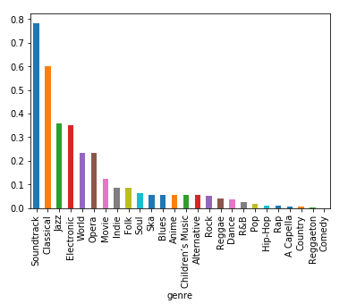

# Music-Genre-Analysis

### Overview
In this project, we gathered information regarding song audio attributes using a dataset from the Spotify API. We utilized this dataset to find trends in audio attributes across different music genres and analyze which attributes are significant in defining boundaries between genres. From there, we attempted to create a model that can predict a song’s genre based on these significant attributes.

### Research Question
Is there a correlation between different attributes of a song and its music genre? Can we predict trends in attributes (i.e., danceability, energy, etc.) within different music genres?

### Background and Prior Work
Traditionally, music is separated into specific genres. People are familiar with common genres such as country, hip-hop, classical, and beyond; however, as music continues to evolve, the lines between genres become more blurred. A recent example of this is Lil Nas X’s song ‘Old Town Road’, a country song with rap elements. ‘Old Town Road’ was removed from Billboard’s ‘Top Country Songs’ chart because Billboard determined that the song itself wasn’t representative enough of Country elements to be included on the ranking. From this instance, we can see that it can be difficult to define the boundaries of where one genre ends and another begins.

Previous studies have been conducted to attempt genre prediction from song attributes. One machine learning study from the University of Rome Tor Vergata tried to classify music genres using MIDI files and analyzed the instrumentation composition of songs (https://pdfs.semanticscholar.org/e214/5add1318af0654a4901fe92080bc8168a9f4.pdf). Another independent study by Victor Ramirez utilized K-Means Clustering to categorize music genres. Ramirez separated songs into different 8 K-Means labels (i.e., Fast & Danceable Instrumentals, Slow Dance, Happy & Upbeat Instrumentals, Slow & Somber Acoustics) and analyzed the audio attributes within each label to find trends (https://medium.com/latinxinai/discovering-descriptive-music-genres-using-k-means-clustering-d19bdea5e443).

Using the findings from these studies, we believe that the audio attributes significant in predicting a song’s genre are ‘acousticness’, ‘instrumentalness’, ‘danceability’, ‘tempo’, and ‘energy’. We believe ‘acousticness’ and ‘instrumentalness’ can predict a song’s genre as the University of Rome Tor Vergata study was able to classify genres through instrumentation. Similarly, we also believe that ‘danceability’, ‘tempo’, and ‘energy’ can be used to predict a song’s genre as Ramirez was also able to highlight differences across categories based on these audial features.

### Hypothesis
Based on the unique audial characteristics that define each music genre, it is hypothesized that certain audio attributes will exhibit significant differences across genres, enabling the establishment of genre boundaries and the ability to predict a song's genre. Specifically, attributes such as 'acousticness', 'danceability', 'instrumentalness', 'tempo', and 'energy' are expected to be key factors in determining a song's genre. This hypothesis is grounded in the premise that for significant differences to exist between genres, the audial characteristics defining each genre must be distinct enough to enable differentiation.

### Dataset used
- Dataset Name: Ultimate Spotify Tracks DB
- Link to the dataset: https://www.kaggle.com/zaheenhamidani/ultimate-spotify-tracks-db
- Number of observations: 228,159

Since we are attempting to predict attribute trends between genres, we utilized data from a Spotify API dataset. This dataset provides data on over 228,000 songs across 26 genres. It includes song attributes determined by Spotify’s algorithms including tempo, key, danceability, energy and more. We used this dataset to find correlations between music genres and the different attributes associated with the songs within these genres.

### Ethics & Privacy

The Spotify dataset we are using originated from user Zaheen Hamidani on 'kaggle.com', an online community for data scientists to host datasets. The information in this dataset was gathered through the official Spotify API and was then cleaned, organized, and uploaded to ‘kaggle.com’. Because the dataset was created using the Spotify API as a source and does not include any surveyed information from people, we can claim that the data is secure. The Spotify API itself is open source, which gives us permission to use this data for this purpose. As a result, this dataset is appropriate to use for our project.

In terms of potential bias, the dataset could be subject to collection bias. The dataset contains information for over 228,159 songs however the number of songs represented per genre is not even. We saw this in the Data Cleaning section where the Comedy genre had 9681 songs, while the A Capella genre had only 119 songs. Though we removed the A Capella genre due to its underrepresentation, the slight difference in representations across genres could still affect how we interpret our analysis. Despite the outlier genre of A Capella, the remaining genres are within ~1500 entries of one another which gives validity when making our interpretations.

### Results
_Average Instrumentalness Across Genres:_

If one has a good model, it is possible to predict trends in genres, it should also be possible to predict genres based on trends.

### How to run locally
1.	Go to https://colab.research.google.com (Internet connection and Gmail account required)
2.	Select “GitHub” in the open window and paste in this URL to copy the project 
3.	Next download the dataset(s) used and upload it on Google Colab by clicking on the ‘Files’ icon on the left-hand side of the screen
4.	Click ‘Runtime’ and select ‘Run all’  

